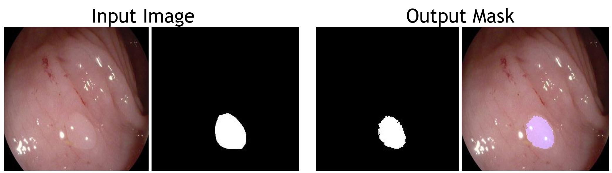

# Precancerous-Tumer-Image-Detection-by-Deep-Learning-


This model was built on [Pytorch-UNet](https://github.com/milesial/Pytorch-UNet). Image data is available here: [data](https://polyp.grand-challenge.org/CVCClinicDB/).

This model implemented image segmentation with U-Net(convolutional networks for biomedical image segmentation) and was trained from scratch with 5000 images with data augmentation because originally there were only 500 images.

## Process
Augment the data to get 5000 images from 500 images.
```
python imgaug.py
```
Normalize file name of image.
```
python normalize_id.py
```
Train the model
```
python train.py -g True -e 100 -b 32 -s 0.8
```


